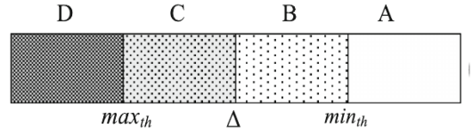
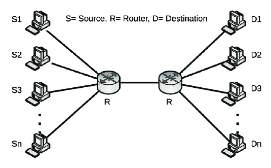
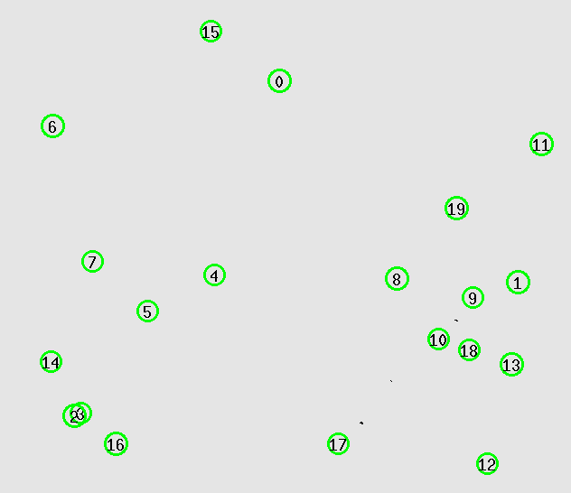

# Flexible Random Early Detection (FXRED)
## Introduction
FXRED is a modification of RED algorithm which is used to control the congestion in the network. The main difference between RED and FXRED is that the latter uses a flexible threshold value instead of a fixed threshold value. The threshold value is calculated using the average queue size and the average packet size. The algorithm is described in the paper [Flexible Random Early Detection Algorithm for Queue Management in Routers](https://www.researchgate.net/publication/348165145_Flexible_Random_Early_Detection_Algorithm_for_Queue_Management_in_Routers).

## Overview of the Algorithm
In the proposed FXRED, the router's queue with finite capacity is divided into four segments (A, B, C, D) via threshold values $min_{th}$, $\Delta$, $max_{th}$ where $\Delta = 1/2 (min_{th} + max_{th})$.



Just like traditional RED and its other variants, in FXRED, average queue length $avg$ is computed,
$$avg = (1-w)avg' + wq(t)$$

There are some other parameters that are used in the algorithm:
- $\lambda(t)$: Total data arrival rate in the bottleneck link at time $t$.
- $\mu$: Bandwidth of the bottleneck link.
- $\rho(t)$: $\rho(t) = \lambda(t)/\mu$

Based on traffic load, three states are defined:

$$ 
  State-1: \rho(t) < 1,\newline
  State-2: \rho(t) \approx 1,\newline
  State-3: \rho(t) > 1. 
$$

`Probability Function`:

$$
  p_d = \begin{cases}
        0 & avg\lt min_{th},\\
        2^{\lfloor k \rfloor}(\frac{avg-min_{th}}{max_{th}-min_{th}})^{\lfloor k\rfloor}.(1-\epsilon) & min_{th} \leq avg \lt \Delta, \\
        2\epsilon(\frac{avg-\Delta}{max_{th}-min_{th}}) + (1-\epsilon) & \Delta \leq avg \lt max_{th}, \\
        1 & avg \geq max_{th}
        \end{cases}
$$

$$
  k = c^{\frac{1}{\gamma}}, c \geq 2, 
  \epsilon = c^{-\gamma}
  \begin{cases}
        \gamma \lt 1 & State-1,\\
        \gamma \approx 1 & State-2,\\
        \gamma \geq c & State-3.
        \end{cases}
$$

## Network Topologies Under Simulation
**`1. Wired`**

A dumbbell shaped topology is used where all the source nodes are connected to a single router and similarly all the destination nodes are connected to a single router. Both the routers are connected to each other through a link. The topology is shown below.



**`2. Wireless`**

Nodes are randomly generated in a square area. For each simulation, a node is selected as source and a number of random nodes are selected as destination. Node configurations are as follows:

- `Node Movement`: Static
- `Wireless MAC Type`: IEEE 802.15.4
- `Routing Protocol`: DSDV
- `Agent`: TCP
- `Application`: FTP

An example of the topology is shown below.



## Parameters Under Variation
To study the effect of different parameters on the performance of the network, the following parameters are varied in the simulation:

Base Parameters:
- `Number of Nodes`: 20
- `Number of Flows`: 10
- `Packets Per Second`: 100
- `Coverage Area`: Tx_Range = 250

Keeping one of the base parameters constant, the other parameters are varied in each simulation as follows:
- `Number of Nodes`: 20, 40, 60, 80, 100
- `Number of Flows`: 10, 20, 30, 40, 50
- `Packets Per Second`: 100, 200, 300, 400, 500
- `Coverage Area`: Tx_Range, 2x Tx_Range, 3x Tx_Range, 4x Tx_Range, 5x Tx_Range

## Modifications in NS-2
The following modifications are made in the NS-2 code to implement the FXRED algorithm:

Two files are changes in the `ns2.35/queue` directory:

**`red.h`** 
- In `struct edp` the following two variables are added:
  ```c
  /*
    * Parameters for FXRED
    */
  double c; /* FXRED: constant c which should be greater than 2 */
  int fxred; /* FXRED: enable/disable FXRED */
  ```
- To keep track of the number of bytes arrived since the last time a packet was dropped, the following variables are added in `struct edv`
  ```c
  int count_bytes;		 /* # of bytes since last drop */
	double count_start_time; /* time when the count is 0 */
  ```
  Notice that the `count` variable is already there to keep track of the number of packets arrived since the last time a packet was dropped. 

- A new method in `REDQueue:Queue` is added to calculate data arrival rate:
  ```c
  /*
    * Calculate data arrival rate
    */
  double getDataArrivalRate();
  ```
**`red.cc`**
Only the class `REDQueue` is modified. The following changes are made:
- To pass parameter from tcl file to the class, the following code is added in `REDQueue::REDQueue()`:
  ```c
  bind("c_", &edp_.c);
	bind_bool("fxred_", &edp_.fxred);
  ```
- The two new parameters are initialized in `REDQueue::initparams()`:
  ```c
  edp_.fxred = 0;
	edp_.c = 2.0;

  edv_.count = 0;
	edv_.count_bytes = 0;
  ```
- In `REDQueue::reset()` just below the line `edv_.count = 0;` the following line is added:
  ```c
  edv_.count_bytes = 0;
	edv_.count_start_time = Scheduler::instance().clock();
  ```
  **These two lines are added everywhere where `edv_.count = 0;` is present.**

- The `REDQueue::calculate_p_new()` is modified to calculate the probability function of FXRED.
  ```c
  /*
  * Calculate the drop probability.
  */
  double
  REDQueue::calculate_p_new(double v_ave, double th_max, int gentle, double v_a, 
    double v_b, double v_c, double v_d, double max_p)
  {
    double p;

    if (edp_.fxred)
    {
      double miu = link_->bandwidth();
      // printf("data arrival rate: %f, miu: %f\n", getDataArrivalRate(), miu);
      double rho = getDataArrivalRate() / miu;
      double gamma = 1;
      double err = 0.01;
      double c = edp_.c;

      if (rho < 1.0 - err)
        gamma = 0.15;
      else if (rho > 1.0 + err)
        gamma = c;

      int k = pow(c, 1 / gamma);
      double epsilon = pow(c, -gamma);

      double th_min = edp_.th_min;
      double delta = (th_max + th_min) / 2;

      if (v_ave < th_min)
        p = 0.0;
      else if (th_min <= v_ave && v_ave < delta)
      {
        p = pow((v_ave - th_min) / delta, k);
        p *= 1 - epsilon;
      }
      else if (delta <= v_ave && v_ave < th_max)
      {
        p = 2 * epsilon * (v_ave - delta) / (th_max - th_min);
        p += 1 - epsilon;
      }
      else
        p = 1.0;

      // printf("rho: %f, gamma: %f, k: %d, epsilon: %f, th_min: %f, delta: %f\n",
      // 	rho, gamma, k, epsilon, th_min, delta);
    }
    else
    {
      if (gentle && v_ave >= th_max)
      {
        // p ranges from max_p to 1 as the average queue
        // size ranges from th_max to twice th_max
        p = v_c * v_ave + v_d;
      }
      else if (!gentle && v_ave >= th_max)
      {
        // OLD: p continues to range linearly above max_p as
        // the average queue size ranges above th_max.
        // NEW: p is set to 1.0
        p = 1.0;
      }
      else
      {
        // p ranges from 0 to max_p as the average queue
        // size ranges from th_min to th_max
        p = v_a * v_ave + v_b;
        // p = (v_ave - th_min) / (th_max - th_min)
        p *= max_p;
      }
      if (p > 1.0)
        p = 1.0;
    }

    // printf("drop probability: %f\n", p);
    return p;
  }
  ```
- `REDQueue::modify_p()`:
  ```c
  /*
  * Make uniform instead of geometric interdrop periods.
  */
  double
  REDQueue::modify_p(double p, int count, int count_bytes, int bytes, 
    int mean_pktsize, int wait, int size)
  {
    if (edp_.fxred)
    {
      p /= (1 - count * p);
    }
    else
    {
      double count1 = (double)count;
      if (bytes)
        count1 = (double)(count_bytes / mean_pktsize);
      if (wait)
      {
        if (count1 * p < 1.0)
          p = 0.0;
        else if (count1 * p < 2.0)
          p /= (2.0 - count1 * p);
        else
          p = 1.0;
      }
      else
      {
        if (count1 * p < 1.0)
          p /= (1.0 - count1 * p);
        else
          p = 1.0;
      }
      if (bytes && p < 1.0)
      {
        p = (p * size) / mean_pktsize;
        // p = p * (size / mean_pktsize);
      }
      if (p > 1.0)
        p = 1.0;
    }
    return p;
  }
  ``` 
- Finally, the new definition of the function `REDQueue::getDataArrivalRate()` is added:
  ```c
  /*
  * Calculates and returns the data arrival rate in bytes/sec.
  */
  double REDQueue::getDataArrivalRate()
  {
    double elapsed_time = Scheduler::instance().clock() - edv_.count_start_time;
    if (elapsed_time == 0.0)
      return 0;
    // printf("REDQueue::getDataArrivalRate(): elapsed_time = %f\n", elapsed_time);
    double rate = edv_.count_bytes / elapsed_time;
    return rate;
  }
  ```

## Results with Graphs:
**`Wired`**


**`Wireless`**


## Summary of Findings:
